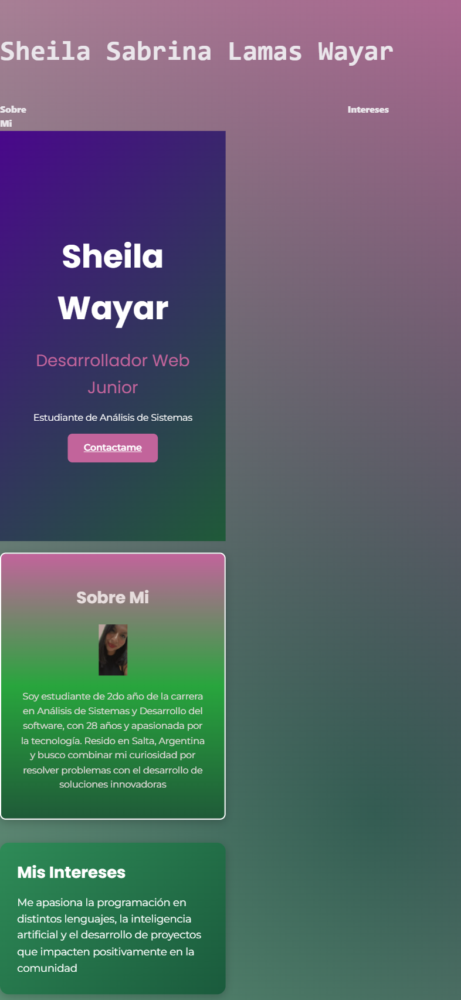

# TP-integrador-
# TP Integrador - Portfolio Responsive

**🔗 Sitio en vivo:** https://sheilawayar.github.io/TP-integrador-/

### Descripción
Portfolio personal desarrollado con HTML5 y CSS3 usando metodología Mobile-First. 
Implementa breakpoints en 768px para tablet y 1024px para desktop.

### Tecnologías utilizadas
- HTML5 semántico
- CSS3 con Flexbox y Grid
- Responsive Design Mobile-First
- Media Queries

### Capturas Responsive

#### Mobile - 393px
Diseño base sin media queries. Grid en 1 columna, sidebar oculto con display: none.

#### Tablet - 820px  
Breakpoint 768px activo. Grid pasa a 2 columnas 250px 1fr. Sidebar visible.

#### Desktop - 1024px
Breakpoint 1024px activo. Max-width 1200px centrado con margin: 0 auto.

